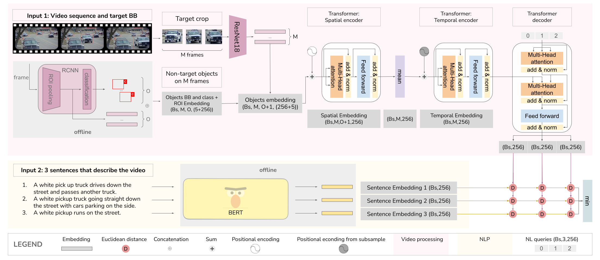

# AI CityChallenge 2021 - Track 5

Public code for _"All You Can Embed: Natural Language based Vehicle Retrieval with
Spatio-Temporal Transformers"_, accepted as CVPR 2021 Workshop.\
This work is our entry for the [5th AI City Challenge](https://www.aicitychallenge.org/), Track 5: Natural-Language based Vehicle Retrieval.

## Model


## Prerequisites

### Environment
* Create a conda environment using the provided `docs/environment.yml` as described [HERE](https://docs.conda.io/projects/conda/en/latest/user-guide/tasks/manage-environments.html#creating-an-environment-from-an-environment-yml-file)
* To create an *identical* environment use `docs/spec-file.txt`
  ```
  conda create --name myenv --file spec-file.txt
  ```
  
### Dataset
* Download AIC_2021 track 5 dataset and extract it somewhere
* Run `extract_vdo_frms.py` from `<challenge_ds_root>/data` to extract the individual frames from each video sequence
  (**warning:** you need to run the script for each S0x sequence, passed as argument).

### Pre-process vehicle crops
To make the training faster the regions of the frames delimited by the tracking bounding boxes are extracted and saved.

  ```
  $ cd data
  $ python precompute_ego_crops.py --ds_root=<challenge_ds_root> --mode=train
  $ python precompute_ego_crops.py --ds_root=<challenge_ds_root> --mode=test
  ```

Additionally, a *--workers* parameter can be set to parallelize the execution.

### Precomputed Object-Embeddings

Object-Embeddings are part of the input to the model.

  ```
  $ cd data
  $ python precompute_rcnn_embs.py --ds_root=<challenge_ds_root> --mode=train
  $ python precompute_rcnn_embs.py --ds_root=<challenge_ds_root> --mode=test
  ```

An additional `--multi_process` flag can be set to *True* to parallelize the execution across multiple GPUs,
with a process per GPU.

Alternatively the pre-computed embeddings can be downloaded from [HERE](https://drive.google.com/drive/folders/1Lo10Nrv4XMq8zPXKv_kFEyjgROMO-PW6?usp=sharing) as *rcnn_embs_t.tar.xz* Extract the provided archive in `<challenge_ds_root>`.

### Precomputed Language embeddings

Since the Visual Language are trained in separate stages the output of the latter is computed offline and used during the remainder of the training.

**WARNING:** This operation can be performed only after the training of the Language branch, alternatively you can download the pre-trained weights
for the language branch, or the pre-computed Language embeddings.

  ```
  $ cd data
  $ python precompute_nl_embeddings.py --ds_root=<challenge_ds_root> --mode=train
  $ python precompute_nl_embeddings.py --ds_root=<challenge_ds_root> --mode=test
  ```

The pre-computed embeddings can be downloaded from [HERE](https://drive.google.com/drive/folders/1Lo10Nrv4XMq8zPXKv_kFEyjgROMO-PW6?usp=sharing) as *precomp_nl_t.tar.xz* Extract the provided archive in `<challenge_ds_root>`.

## Training

### Language Branch

The training of the language branch is provided as a separate training script built with Pytorch Lightning.
To reproduce the Language-Triple (LT) version used for the experiments presented on the paper:

```
  $ cd nlp
  $ python Bert_ft.py --ds_root=<challenge_ds_root>
```

This training is very phase and will take approximately 10 minutes on a single Nvidia RTX 2080Ti.
When the training is finished a folder named `bert_ft_experimental` will ba saved into the nlp directory.

**Pretrained:** To instead use the pretrained weights download [HERE](https://drive.google.com/drive/folders/1Lo10Nrv4XMq8zPXKv_kFEyjgROMO-PW6?usp=sharing) the archive `bert_finetuned.tar.xz` and extract it to the nlp directory.
Now you can execute the *Precomputed Language embeddings* procedure above.

### Visual Branch

The best performing model (**MRR=0.1078**) has been trained on two Nvidia A100 GPUs, other hardware configurations have not been tested.

Edit the configuration file `./conf/experiments/best.yaml`, the `DATASET` option must correspond to the absolute path to the extracted dataset, where you must also have the precomputed data.\
Additionally the `LOG_DIR` option can be set to where you want to save training logs and checkpoints.

Run the training as follow:
```
  $ python main.py --exp_name=best! --seed=6969
```

**WARNING:** If you train on a different GPUs configuration please notice that the `BATCH_SIZE` option define the batch size for each of the available GPUs!

## Inference
This operation will provide you with a `.json` result file in the format required for submission. 

Run the training as follow:
```
  $ python main.py --exp_name=best --seed=6969 --mode=test
```

The output is saved to `<LOG_DIR>/AYCE_2021/best/test_result.json`

### Pretrained weights

The pretrained weights for the best model are available for [Download](https://drive.google.com/drive/folders/1Lo10Nrv4XMq8zPXKv_kFEyjgROMO-PW6?usp=sharing).
Extract the provided archive `best.zip` and copy the `trainin.ck` file to `<LOG_DIR>/AYCE_2021/best/`, then perform the evaluation procedure.


## Reference
TBD;
